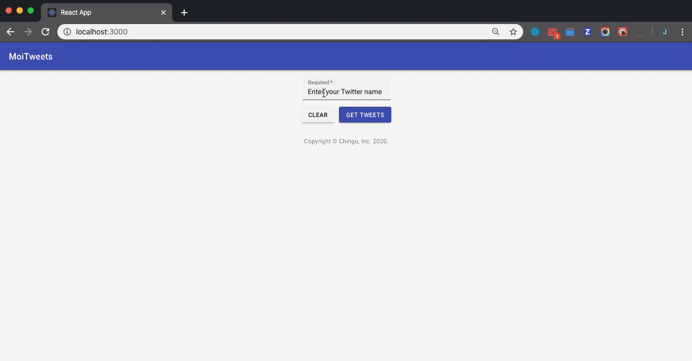

# Chingu Solo Project - Tier 2 - MoiTweets

## Overview ##

In this project you will use the Twitter API to extract public Tweets for given user as a JSON file that
you will then write to the local file system. This project is a way for you to transition from Tier 2 to Tier 3 since it requires not just a frontend browser app, but also a simple backend server. 

This project will make a great addition to your portfolio piece since it requires you to implement a fullstack
architecture with a frontend app that uses an API gateway in the backend app to retrieve the data from through
the Twitter API.

You'll be responsible for coding the **HTML**, **CSS**, and **JavaScript** to get the structure, styling, and functionality up and running.

**You May Use Frameworks and/or Libraries of Your Choosing**

## Instructions ##

Unlike a normal Tier 2 app this project must be implemented as both a front-end app and a backend app.

General instructions for all Solo Projects can also be found in the Chingu Voyage Handbook (URL posted in the #read-me-first channel on Discord).

**Requirements**

*Structure*
- [ ] Header with at least the app name
- [ ] An input area the user can enter the name of the Twitter user whose Tweets are to be extracted
- [ ] 'Clear' and 'Get Tweets' buttons should be a part of this input area
- [ ] An scrollable output area where the JSON representation of the users Tweets is displayed
- [ ] A second input area that allows the user to specify where the JSON will be written to in the local
file system
- [ ] 'Clear' and 'Save' buttons should be a part of this input area
- [ ] Footer section with your developer information

*Style*
- [ ] You are responsible for implementing a style of your own design
- [ ] Buttons/links should be evident (make sure the cursor changes, etc.)

*Functionality*
- [ ] The 'Get Tweets' button should be disabled until the user enters a Twitter user name
- [ ] When the 'Get Tweets' button is clicked the FE should retrieve the JSON represention of that users
Tweets and display it in the output area of the window
- [ ] The 'Clear' button associated with the Twitter name input area should clear the contents of the
input area as well as the output area.
- [ ] The user must be given the choice of saving the Tweets JSON to either a new or existing file on the
users local file system.
- [ ] The 'Clear' button associated with the output file area should clear all fields in the window. It 
should reset the page as if the page were reloaded (do not actually reset the page)
- [ ] Errors must be intercepted and appropriate messages displayed to the user 

*Other*
- [ ] Your repo needs to have a robust README.md
- [ ] Make sure that there are no errors in the developer console before submitting

**Extras (Not Required)**

- [ ] Make your design fully responsive (small/large/portrait/landscape, etc.)
- [ ] Instead of displaying the JSON, instead display cards summarizing each tweet. 

## API Information ##

This project utilizes the Twitter API to retrieve the users [**timeline**](https://developer.twitter.com/en/docs/tweets/timelines/api-reference/get-statuses-user_timeline) and your app will need to authenticate using
[**OAUTH2 bearer token**](https://developer.twitter.com/en/docs/basics/authentication/oauth-2-0). You will need to register for a free api key in order to complete this project as calls to the developer api are severely capped without one.

**_Good Luck!!!_**
